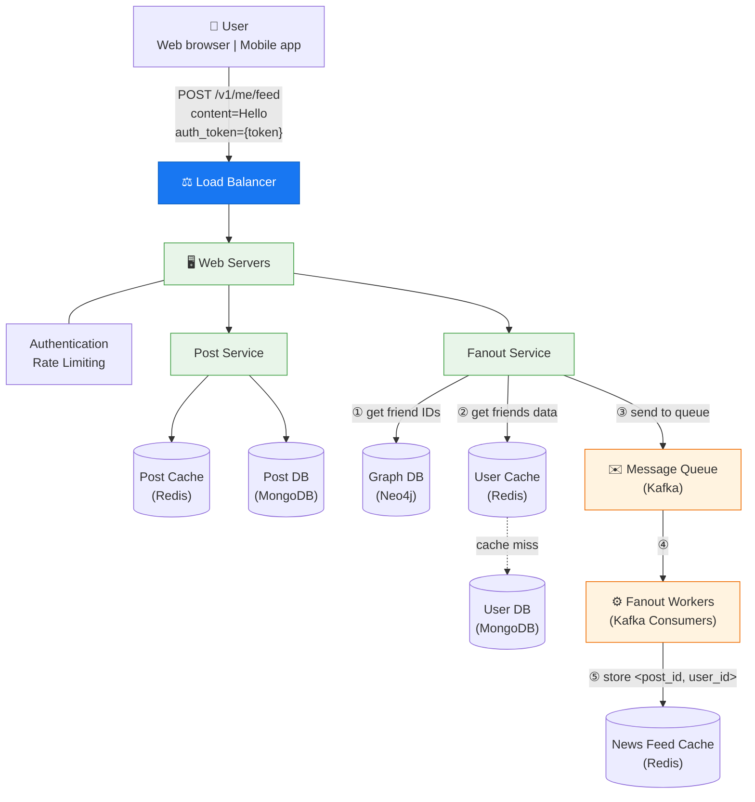
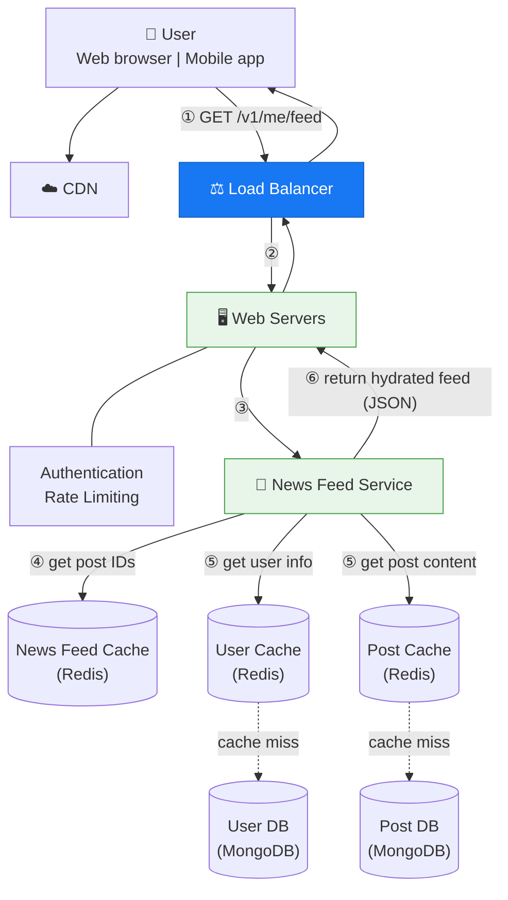

# 📰 News Feed System

A scalable news feed system designed for **10 million DAU**, supporting feed publishing with fanout-on-write and real-time news feed retrieval. Built with **Python/FastAPI**, **React**, **MongoDB**, **Redis**, **Kafka**, and **Neo4j**.

---

## 📋 Features

- A user can **publish a text post** and see friends' posts on the news feed page
- Feed is sorted in **reverse chronological order**
- A user can have up to **5,000 friends**
- **Hybrid fanout model**: push for normal users, pull for high-follower users
- **JWT authentication** with sliding-window **rate limiting**
- Real-time feed updates via cache-first architecture

---

## 🏗️ Architecture Overview

The system is divided into two main flows:

### 1. Feed Publishing Flow

When a user publishes a post, the data is written to cache and database, then fanned out to friends' news feed caches.



**Flow Details:**

1. A user makes a post via `POST /v1/me/feed?content=Hello&auth_token={token}`
2. **Load Balancer** distributes traffic to web servers
3. **Web Servers** enforce authentication (valid JWT) and rate limiting (10 posts/min per user)
4. **Post Service** persists the post to MongoDB and Redis post cache
5. **Fanout Service**:
   - ① Fetches friend IDs from **Neo4j** graph database
   - ② Gets friend info from **User Cache** (Redis)
   - ③ Sends friend list + post ID to **Kafka** message queue
6. **Fanout Workers** consume from Kafka and write `<post_id, user_id>` mappings to the **News Feed Cache** (Redis sorted sets)

> **Hybrid Fanout**: Users with ≤ 1,000 friends use **push model** (fanout-on-write). Users with > 1,000 friends use **pull model** (fanout-on-read) to avoid system overload.

---

### 2. News Feed Retrieval Flow

News feed is built by reading post IDs from cache and hydrating with full user/post data.



**Flow Details:**

1. User sends `GET /v1/me/feed`
2. **Load Balancer** routes request to web servers
3. **Web Servers** authenticate and forward to News Feed Service
4. **News Feed Service** gets post IDs from **News Feed Cache** (Redis sorted set, reverse chronological)
5. Hydrates the feed by fetching **user info** (User Cache → User DB) and **post content** (Post Cache → Post DB)
6. Returns fully hydrated news feed as JSON to the client

> The news feed cache stores only post IDs to minimize memory usage. Cache miss rate is low since users mostly view recent content. Cache is capped at **500 entries** per user.

---

## 🛠️ Tech Stack

| Component | Technology | Purpose |
|-----------|-----------|---------|
| **Backend API** | Python / FastAPI | REST API server with async support |
| **Frontend** | React (Vite) | Single-page web application |
| **Document DB** | MongoDB | Post storage, user profiles |
| **Cache** | Redis | Post cache, user cache, news feed cache, rate limiting |
| **Message Queue** | Apache Kafka | Async fanout message delivery |
| **Graph Database** | Neo4j Community | Friend relationships & traversal |
| **Auth** | JWT + bcrypt | Stateless authentication |

---

## 📡 API Reference

| Method | Endpoint | Description | Auth |
|--------|----------|-------------|------|
| `POST` | `/v1/auth/register` | Register a new user | No |
| `POST` | `/v1/auth/login` | Login and receive JWT token | No |
| `POST` | `/v1/me/feed` | Publish a text post | ✅ |
| `GET` | `/v1/me/feed` | Retrieve news feed (paginated) | ✅ |
| `POST` | `/v1/me/friends` | Add a friend by username | ✅ |
| `GET` | `/v1/me/friends` | List all friends | ✅ |

**Authentication**: Pass token via `Authorization: Bearer {token}` header or `?auth_token={token}` query parameter.

---

## ⚙️ Key Design Decisions

| Decision | Details |
|----------|---------|
| **Fanout on write** | Posts pushed to friend feed caches immediately for fast reads |
| **Hybrid fanout** | Pull model for users with > 1,000 friends to prevent system overload |
| **Max 5,000 friends** | Enforced at the graph DB level |
| **Feed cache limit** | 500 most recent post IDs per user (configurable) |
| **Rate limiting** | 10 posts/min per user via Redis sliding window |
| **Cache-first reads** | Redis caches with MongoDB fallback on cache miss |
| **Kafka for fanout** | Decouples post creation from fan-out processing |
| **Neo4j for friendships** | Graph DB optimized for relationship traversal |

---

## 🚀 Quick Start

### Prerequisites

- **Docker** & **Docker Compose**
- **Python 3.12+**
- **Node.js 18+**

### 1. Start Infrastructure

```bash
docker-compose up -d
```

This starts MongoDB, Redis, Kafka + Zookeeper, and Neo4j.

### 2. Start Backend API

```bash
cd backend
pip install -r requirements.txt
python -m uvicorn main:app --reload --port 8000
```

### 3. Start Fanout Worker (separate terminal)

```bash
cd backend
python message_queue/worker.py
```

### 4. Start Frontend (separate terminal)

```bash
cd frontend
npm install
npm run dev
```

Open **http://localhost:5173** in your browser.

### 5. Verify Everything Works

```bash
cd backend
pip install httpx
python smoke_test.py
```

This runs a full end-to-end smoke test verifying all components (MongoDB, Redis, Neo4j, Kafka) and the complete publish → fanout → retrieve flow.

---

## 📁 Project Structure

```
├── docker-compose.yml              # Infrastructure: MongoDB, Redis, Kafka, Neo4j
│
├── backend/
│   ├── main.py                     # FastAPI application entry point
│   ├── config.py                   # Configuration & environment variables
│   ├── smoke_test.py               # End-to-end verification script
│   ├── requirements.txt            # Python dependencies
│   │
│   ├── models/                     # Pydantic request/response models
│   │   ├── user.py
│   │   └── post.py
│   │
│   ├── database/                   # Database connections
│   │   ├── mongodb.py              # MongoDB (Post DB + User DB)
│   │   └── graph_db.py             # Neo4j (friend graph)
│   │
│   ├── cache/                      # Redis cache layers
│   │   ├── redis_client.py         # Redis connection
│   │   ├── post_cache.py           # Post cache operations
│   │   ├── user_cache.py           # User cache operations
│   │   └── newsfeed_cache.py       # News feed cache (sorted sets)
│   │
│   ├── message_queue/              # Kafka producer & consumer
│   │   ├── producer.py             # Kafka producer (sends fanout messages)
│   │   └── worker.py               # Fanout worker (Kafka consumer)
│   │
│   ├── services/                   # Business logic
│   │   ├── auth_service.py         # JWT + bcrypt authentication
│   │   ├── post_service.py         # Create & retrieve posts
│   │   ├── fanout_service.py       # Fanout orchestration
│   │   ├── newsfeed_service.py     # Feed hydration & assembly
│   │   └── friend_service.py       # Friend management (Neo4j)
│   │
│   ├── middleware/                  # Request middleware
│   │   ├── authentication.py       # JWT auth dependency
│   │   └── rate_limiter.py         # Redis sliding window rate limiter
│   │
│   └── routes/                     # API route handlers
│       ├── auth.py                 # /v1/auth/*
│       ├── feed.py                 # /v1/me/feed
│       └── friends.py              # /v1/me/friends
│
└── frontend/
    ├── vite.config.js              # Vite config with API proxy
    └── src/
        ├── App.jsx                 # Main app with auth routing
        ├── App.css                 # Styles
        ├── services/
        │   └── api.js              # API client
        └── components/
            ├── Login.jsx           # Login form
            ├── Register.jsx        # Registration form
            ├── NewsFeed.jsx        # Feed display (auto-refreshes)
            ├── PostForm.jsx        # Create post form
            ├── PostCard.jsx        # Individual post card
            ├── FriendsList.jsx     # Friends panel with add friend
            └── Layout.jsx          # Nav bar & layout
```

---

## 📊 Scale Considerations

This architecture is designed for **10 million DAU** with the following characteristics:

- **Write path**: Post creation is synchronous (fast), fanout is asynchronous via Kafka (scalable)
- **Read path**: Cache-first with < 1ms Redis reads; MongoDB fallback for cache misses
- **Fanout workers**: Horizontally scalable Kafka consumers
- **News feed cache**: Sorted sets provide O(log N) inserts and O(log N + M) range queries
- **Graph traversal**: Neo4j handles friend lookups efficiently even at 5,000 friends per user
